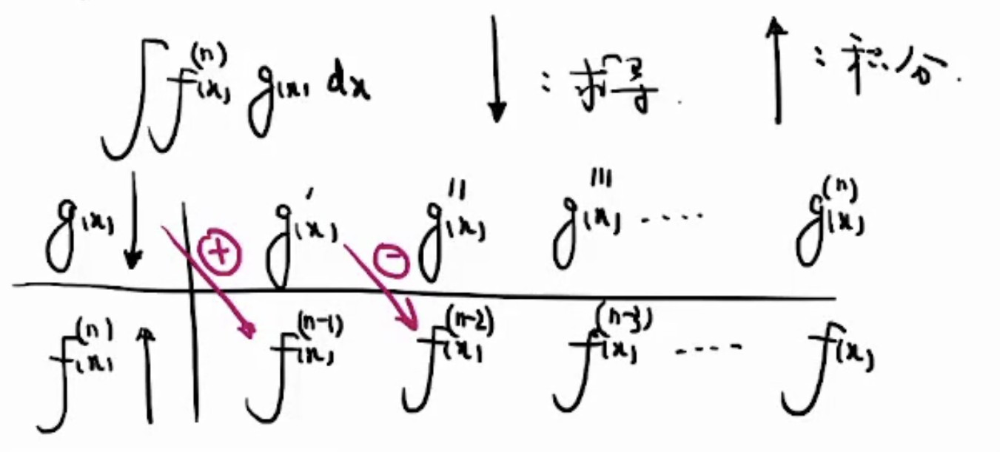

# 不定积分
连续函数必有原函数
## 基本初等函数
$$
\int \sec^2xdx = tanx + c\\
\int \sec x \tan x=\sec x+c\\
\int \csc^2 x dx = -\cot x+c\\
\int \csc x \cot xdx = -\csc x +c\\
\arcsin x+\arccos x \Leftrightarrow\arcsin x - (-\arccos x)=\frac{\pi}{2}
$$
$$
\int \frac{1}{\sqrt{x^2+1}}dx=\ln(x+\sqrt{x^2+1})+c
$$
## 积分方法
### 分部积分
$$
\int f^{'}(x)g(x)dx=f(x)g(x)-\int f(x)d{g(x)}
$$
#### 进阶表格法
$$
\int f^{(n)}g(x)dx=\int g(x)d{f^{(n)}}
$$

## 重要专题