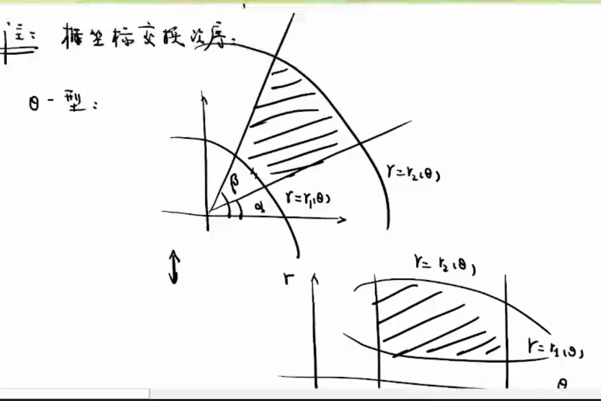
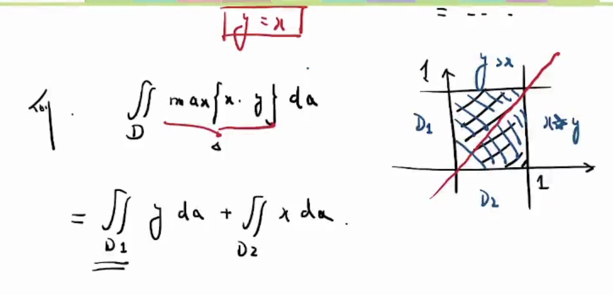

# 特殊
$$
\frac{sinx}{x}\\
\frac{\cos x}{x}\\
e^{\frac{1}{x}}\\
e^{-x^2}
e^{x^2}
$$
# 重积分
常见考法，给定f(x,y)在一区域内的积分，在该区域x，y分别求上下限最后带进去求;划分区域非常重要
$$
f(x,y)=0\Rightarrow f(rcos \theta,rsin \theta)\\
r = r(\theta)
$$
## 性质
### 线性运算
$$
\int\int_D \lambda f(x,y) \pm kg(x,y)da=\lambda\int\int 
f(x,y)da \pm k \int\int g(x,y)da
$$
$$
\int\int f(x,y)da=\int\int_{D1} f(x,y)da + \int\int_{D2} f(x,y)da
$$
## 常见的算法
$$
先y再x\\
\iint f(x,y)da = \int^a_bdx\int^{\phi(x)}_{\phi(x)}f(x,y)dy\\
Dx={a\leq x \leq b;\phi(x)_下\leq y\leq\phi(x)_上}
\\
先x再y\\
\iint f(x,y)da = \int^d_cdy\int^{\phi(y)}_{\phi(y)}f(x,y)dx\\
Dx={c\leq y \leq d;\phi(y)_下\leq x\leq\phi(y)_上}
$$
$$
极坐标\\
\int^{\alpha}_{\beta}d{\theta}\int^{r_2{\theta}}_{r_1{\theta}}f(rcos\theta,rsin{\theta})rdr\\
{\alpha\leq\theta\leq\beta;r_1{\theta}\leq r \leq r_2{\theta}}
da = rd\theta dr
$$
## 积分区域可拆
$$
面积D可分为D1和D2,则\iint f(x,y)da = \iint_{D1}+\iint_{D2}
$$

***

分段积分
### 二重积分比较大小
$$
f(x,y)\geq g(x,y)在D成立
\Rightarrow \iint_Df(x,y)\geq \iint_Dg(x,y)\\
反之不成立
$$
### 积分中指定理
$$
\iint_Df(x,y)da = f(s,n)S(D)((s,d)\in D)
$$
## 对称性简化重积分运算
二元函数没有奇偶性，但有关于x或y的奇偶性
### 积分区域关于X轴对称
$$
\iint_d(x,y)=\iint_{D_1/D_2}[f(x,y)+f(x,-y)]\\
关于y变量是奇函数，则原式=0\\
关于y变量是奇函数，则f(x,y)=f(x,-y)
$$
### 积分区域关于y轴对称
$$
\iint_d(x,y)=\iint_{D_1/D_2}[f(x,y)+f(-x,y)]\\
关于x变量是奇函数，则原式=0\\
关于x变量是奇函数，则f(x,y)=f(-x,y)
$$
### 积分区域关于y=x对称
$$
\iint_d(x,y)=\iint_{D_1/D_2}[f(x,y)+f(y,x)]\\
$$
### 关于原点对称
$$
\iint_d(x,y)=\iint_{D_1/D_2}[f(x,y)+f(-x,-y)]\\
$$
## 应用
如果是绕x=n这一条线，与之相对的，半径就要改变
$$
V_x=\iint_D2\pi yda\\
V_y=\iint_D2\pi xda\\
$$

## 极坐标
$$
y=f(x)\\
r=\phi (\theta)\\

r = xcos\theta \\
r = ysin\theta\\
r=\phi (\theta)\\左右同时乘r带入进去就可以得f(x)
$$
